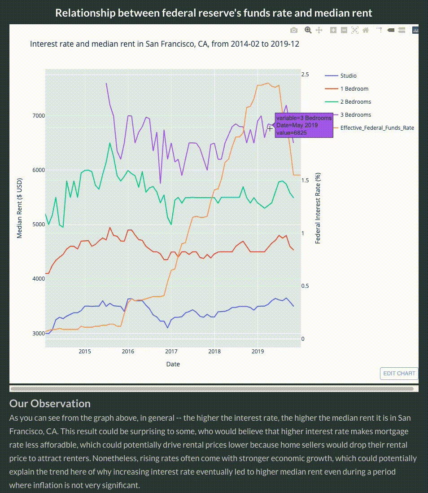
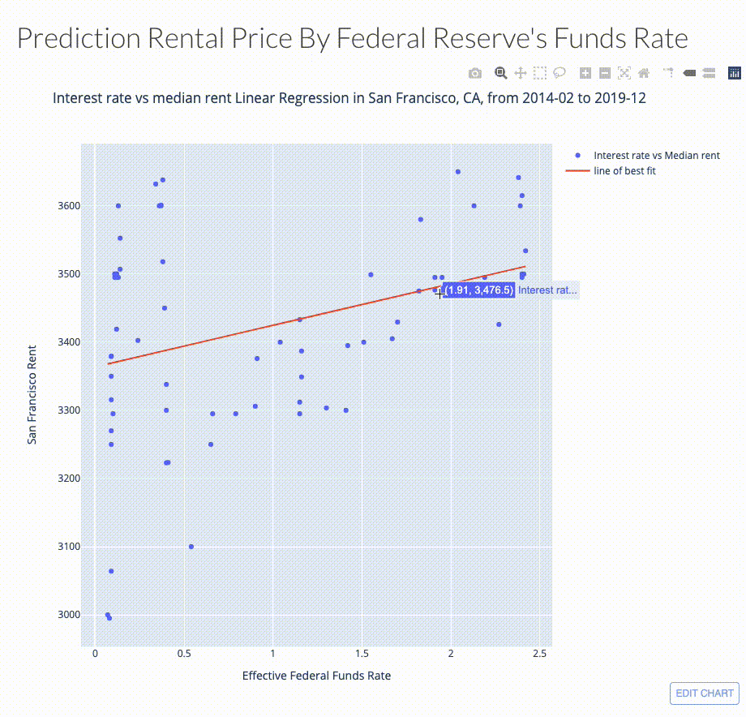
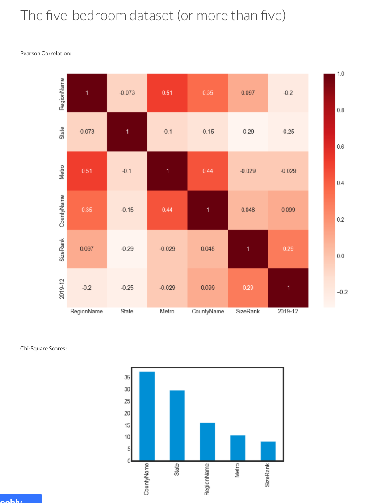

# 05839-final-project (Rental Price Insights)
# Group 18 (Ed Tsoi, Jiawei Ni, Yuzong Gao, Zhaoyi Ma)

Website url: http://rentalprice.weebly.com/

## Introduction/Motivation:
- 2020-2021 is certainly a crazy year to be in. With the COVID-19 pandemic still ongoing, numerous lives have been lost and the world's economy has been hit extremely hard. Housing cost, as we can observe, is changing drastically among the States. To help people determine how the world's changing conditions would affect the median rental price in the city that they want to live in, we have examined both the Federal Reserve's interest rate and the Zillow house price datasets (which includes median rental prices for different apartments) to derive interesting relationships that we think could be very beneficial to both renters and investors.

## Goals of our project:
1. Learn about whether there is a correlation between Federal Reserve's interest rate and median rental prices by combining multiple datasets and derive/infer a relationship between them
2. Determine what factors (e.g. state, metro, region, number of bedrooms) will affect rental prices the most (this is done by using the advanced machine learning technique of feature selection -- Pearson correlation)
3. Predict the future median rental prices in their city by using our pre-trained machine learning model (linear regression)
4. Ultimately, we know that 2020-2021 is a crazy hard year to invest in. And with the current complex economic environments, it might be really hard to strategize investment and renting strategies. We hope that our project could be useful to our audience, to help renters get the best deal possible and to help investors predict the real estate rental price accurately using an interactive, data-driven approach. 

## Video Presentation:

## Website/Interactive application sections breakdown
|Section | Description |
|------------ | ------------------------------------------------------|
| `Introduction` | Describe a brief introduction of our project. Also describe motivation of our work, our goals from this project, our approach, and contains our video presentation (in Youtube embedded format)       |
| `Dataset`| Describe some data cleaning that we have done, and our chosen dataset's quality (Four C's of Data Quality)|
| `Interest Rates and Rent`| Visualization of the relationship between federal reserve's interest rate and median rental prices in San Francisco, Seattle, Dallas, Queens, Tucson, Columbus and more. Also contains linear regression machine learning model to predict rental prices based on interest rate. Briefly describe inflation, which is also a factor that could impact rental prices. |
| `Feature Selection`| Section where we utilize advanced machine learning techniques such as feature selection. Demonstrated artifacts using Pearson correlation and Chi Square analysis of different cities data to tell our story.|

## Datasets of choice:
- [Zillow house price and rental price data](https://www.kaggle.com/paultimothymooney/zillow-house-price-data/tasks?taskId=369)
- [Federal Reserve interest rate and unemployment data, 1954-Present](https://www.kaggle.com/federalreserve/interest-rates)

## Data Quality
To measure the quality of our chosen datasets above, we use the "Four C's of Data Quality Rule".
1.  Data Completeness:
    - We have thoroughly inspected the two datasets. Unsurprisingly, there are several columns that contain missing data (which is also captured in the images above). Moreover, we found that the name of the dataset "Federal Reserve Interest Rate (1954-Present)" to be misleading. Even though the name of the dataset suggests that the data include current year data (2021), in reality it has not been updated since 2017. Therefore, we have manually collected here to make the data more complete.
2.  Data Coherence:
    - Coherence of month and date between the two datasets: We found the data in the two datasets to have relatively coherent dates. For instance, in the Zillow housing price dataset, dates are represented in YYYY-MM format, whereas data in the Federal Reserve Interest Rate dataset contains both Year and Month information. A new simple columning joining year and month will make the dates of the two datasets identical.

    - Coherence of data between different types of apartments (studio, one-bedroom, two-bedrooms etc.): The data inside those csv files across different types of apartments are highly coherent and share the same format and unit of median rent ($USD), and relatively coherent across states.
3.  Data Accountability:
    - **Zillow House Price dataset:** There are multiple excel files within the dataset that we used for this data exploration project, including:
        - seattle.xlsx
        - queens.xlsx
        - columbus.xlsx
        - dallas.xlsx
        - chicago.xlsx
        - tucson.xlsx
  
    These files were cleaned and extracted from City_MedianRentalPrice_<type_of_apartments>.csv from the original dataset, and contain median rental price information for studio, one-bedroom, two-bedrooms, three-bedrooms and sales price city from the period 2014-02 to 2019-11. We have verified the dataset using the ones download from Zillow.com/research/data, and found the data to be exact match, which means they are very likely to be accurate.
    
    - **Federal Reserve Funds Rate dataset:** The federal reserve fund rate dataset that we have also matches with the one on the federal's official website, which proves it accountability.
 
4. Data Correctness:
   - We have dived and researched into the median rental prices over the years for all the different cities that we are interested in (Chicago, Seattle, Dallas, Tucson, Columbus, Queens), and no median rent data deviates from the expected range. Moreover, both Zillow and Federal Reserve are very accountable, which should further proves the data's correctness.

## Our Approach:
### Data cleaning (EDA):
1. After thorough inspection, we found that the dataset "Federal Reserve Interest Rates, 1954-Present" only contains interest rate data up to 2017-03. Therefore, we have gathered interest rate data from 2017-04 to 2019-12 here: [Effective Federal Funds Rate](https://ycharts.com/indicators/effective_federal_funds_rate_monthly)

2. [Zillow House Price dataset] - **Time Period Columns:** As the scope of this project only covers data from Jan 2014 to Dec 2019, data prior to this range (2010 to 2013) is dropped. We also noticed that there are tons of NaN, we decided to skip them while calculating. The main reason for not using mean/median to fill them out is that they could potentially destruct the variance of the data and thus lead to an underestimate of standard errors, which is crucial for analysis.

3. [Zillow House Price dataset] - **#:**  this column serves as an index column which is not necessarily needed and actually redundant as we can view and manipulate with the  indice by using Jupyter's built-in features. So to keep the chart simple, it is dropped.

4. [Federal Reserve Interest Rates, 1954-Present] - After thorough inspection, we found that the dataset "Federal Reserve Interest Rates, 1954-Present" only contains interest rate data up to 2017-03. Therefore, we have gathered interest rate data from 2017-04 to 2019-12 here: Effective Federal Funds Rate

5. We also drop all the NaN values in our dataset.

### Visualization:
1. To determine the relationship between interest rate and median rental prices, we drew a graph using plotly to visualize whether increase in interest rates led to increase in rental prices. 
    - Based on the graphs, we observe that increase in federal's interest rate led to increase in median rent
    - We had drew visualizations for locations including San Francisco, Seattle, Tucson, Dallas, Chicago and Queens. These cities are across different states in the US (from west coast to mid west to east coast) to eliminate location biases.
    

2. To predict rental prices in different cities based on interest rate, we also applied machine learning techniques (linear regression). The linear relationship confirmed our previous observation of "the higher the interest rate, the higher the median rental price". This observation also made sense to us, since higher interest rate often comes with stronger economic growth, which could boost rental prices.
   
    
3. Lastly, we also help investors and renters examine whether they are overpaying or getting a good deal on their selected properties, and determine how strong an impact external factors (size of cities, city name, metro, state etc.) have on the median rental price. To do so, we applied advanced machine learning techniques of feature selection:
   - **Pearson Correlation:** measures a linear correlation between variables. A positive Pearson Correlation coefficient represents that there is a positive relationship. A negative coefficient represents that there is a negative relationship.
   - **Chi-Square analysis:** used for finding relationship between categorical variables using p-value. P-value can represent whether a feature is independent from the target.  We can also rank feature importance by using Chi-Square.

    

Thank you for your patience in reading this! We hope you enjoyed our project :D

